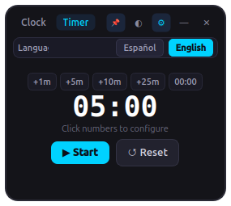
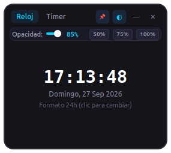
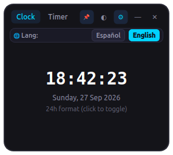

# 🕒 Clock & Timer (Reloj & Temporizador Flotante)

<p align="center">
  
</p>

<p align="center">
  <strong>A modern, minimalist, always-on-top desktop clock and countdown timer widget.</strong><br>
  <em>Diseñado para Linux (Ubuntu, Fedora, Arch) y 100% compatible con Windows.</em>
</p>

<p align="center">
  <a href="https://github.com/JohnmaDev/Clock-Timer/releases"></a>
  <a href="LICENSE"></a>
  
  
  
  <a href="https://github.com/flathub/flathub/pull/10413"></a>
</p>

---

## 📸 Screenshots / Capturas

<p align="center">
  
  
</p>
<p align="center">
  
  
</p>

---

## ✨ Features / Características

- 📌 **Always on Top (Siempre al Frente)**: Stays permanently visible above all programs, workspaces, full-screen apps, or games. Includes an instant toggle pin icon (`📌`).
- 🪟 **Frameless & Resizable (Sin Marcos y Redimensionable)**: Minimalist dark UI without bulky OS title bars. Freely draggable and scalable from any of its 4 edges or bottom-right corner.
- 📐 **Dynamic Typography Scaling**: Clock and timer digits automatically scale proportionally as you resize the window.
- 🕒 **Clock Mode**: Displays hours, minutes, seconds, and localized full date. Click the clock face to switch between **24-hour** and **12-hour AM/PM** format.
- ⏳ **Countdown Timer**: 
  - Quick presets: `+1m`, `+5m`, `+10m`, `+25m (Pomodoro)` and `00:00` reset.
  - Click digits to open custom precision minute/second spinbox dial.
  - Multi-alert alarm: System desktop notification (`notify-send`), terminal/system audio alert (`beep`), and visual flashing warning.
- ◐ **Interactive Opacity Control**:
  - Click `◐` to open the quick opacity slider (30% to 100%) with quick jump buttons (`50%`, `75%`, `100%`).
  - **Mouse Wheel Scroll**: Simply roll your mouse scroll wheel anywhere over the widget to dynamically increase or decrease transparency on the fly.
- 🌐 **Full Bilingual Support (English / Spanish)**:
  - Settings button `⚙` opens instant language switch between English and Spanish.
  - Persists preference automatically across restarts using `QSettings`.

---

## 🕹️ Keyboard & Mouse Controls / Atajos

| Action / Acción | Control / Gesto |
| :--- | :--- |
| **Move window** / Mover ventana | Click and drag the top header bar |
| **Resize** / Redimensionar | Drag any of the 4 borders or bottom-right corner |
| **Adjust opacity on the fly** / Opacidad al vuelo | **Mouse scroll wheel** over the window |
| **Toggle Opacity slider** / Desplegar barra de opacidad | Click `◐` button |
| **Toggle Settings / Language** / Cambiar idioma | Click `⚙` button |
| **Switch Clock / Timer tab** / Alternar pestaña | `Tab` key or click tab label |
| **Start / Pause Timer** / Iniciar o pausar | `Space` key |
| **Close app** / Cerrar | `Escape` key or `✕` button |

---

## 🚀 Installation & Running / Instalación y Uso

### 🐧 Linux (Ubuntu / Debian / Fedora / Arch)

#### Option 1: Quick Launcher (Recomendado)
```bash
git clone https://github.com/JohnmaDev/Clock-Timer.git
cd Clock-Timer
chmod +x run.sh
./run.sh
```
*(Automatically sets up virtual environment and installs dependencies if needed).*

#### Option 2: Run with Python venv
```bash
python3 -m venv .venv
source .venv/bin/activate
pip install -r requirements.txt
python3 main.py
```

#### Option 3: Add to Desktop Menu / Dock
```bash
cp io.github.JohnmaDev.Clock-Timer.desktop ~/.local/share/applications/
```

---

### 📦 Flatpak & Flathub
This application follows official Freedesktop and Flathub packaging guidelines:
- **App ID**: `io.github.JohnmaDev.Clock-Timer`
- **Metadata**: [io.github.JohnmaDev.Clock-Timer.metainfo.xml](io.github.JohnmaDev.Clock-Timer.metainfo.xml)
- **Manifest**: [io.github.JohnmaDev.Clock-Timer.yaml](io.github.JohnmaDev.Clock-Timer.yaml)

To track the official review and approval progress, visit Flathub PR [#10413](https://github.com/flathub/flathub/pull/10413).

---

### 🪟 Windows

1. Install Python 3.10+ from [python.org](https://www.python.org/) (*check "Add Python to PATH"*).
2. Clone and enter the repository:
   ```cmd
   git clone https://github.com/JohnmaDev/Clock-Timer.git
   cd Clock-Timer
   pip install -r requirements.txt
   python main.py
   ```

#### 📦 Download Standalone Executable (.exe)
You don't need Python installed! Download the pre-built `Clock-Timer-Windows-x64.exe` directly from the [GitHub Releases](https://github.com/JohnmaDev/Clock-Timer/releases) page.

Or compile it yourself with PyInstaller:
```cmd
pip install pyinstaller
pyinstaller --onefile --windowed --name "Clock-Timer-Windows-x64" --icon "icon.png" --add-data "app;app" --add-data "icon.png;." main.py
```

---

## 🤖 Continuous Integration / GitHub Actions

This repository includes an automated workflow [`.github/workflows/release.yml`](.github/workflows/release.yml). Every time a release tag (e.g. `v1.0.0`) is pushed:
1. Validates AppStream metainfo and `.desktop` files.
2. Compiles a standalone Linux binary (`Clock-Timer-Linux-x86_64`).
3. Compiles a standalone Windows executable (`Clock-Timer-Windows-x64.exe`).
4. Automatically publishes a GitHub Release with both binaries ready for download.

---

## 📂 Project Structure / Estructura del Proyecto

```text
Clock-Timer/
├── .github/
│   └── workflows/
│       └── release.yml                 # Automated Linux & Windows CI/CD release builder
├── app/
│   ├── __init__.py                     # Package initialization
│   ├── clock_widget.py                 # Responsive clock display & 12h/24h toggle
│   ├── i18n.py                         # Internationalization engine (EN / ES) & settings
│   ├── styles.py                       # Modern dark-mode QSS stylesheets
│   ├── timer_widget.py                 # Countdown timer, presets, alarms & notification
│   └── window.py                       # Frameless floating window, resizing & controls
├── assets/
│   ├── branding/                       # Design concepts & exploration artwork
│   ├── icons/                          # Application icon (512x512 circular PNG)
│   └── screenshots/                    # UI preview screenshots
├── io.github.JohnmaDev.Clock-Timer.desktop     # FreeDesktop desktop entry
├── io.github.JohnmaDev.Clock-Timer.metainfo.xml# AppStream 1.0 metadata
├── io.github.JohnmaDev.Clock-Timer.png         # Standard App ID icon
├── io.github.JohnmaDev.Clock-Timer.yaml        # Flatpak build manifest
├── LICENSE                             # MIT License
├── main.py                             # Application entry point
├── README.md                           # Documentation
├── requirements.txt                    # Python dependencies (PyQt6)
└── run.sh                              # Linux auto-launcher script
```

---

## 📄 License

Distributed under the **MIT License**. See [LICENSE](LICENSE) for more details.

Developed with ❤️ by [JohnmaDev](https://github.com/JohnmaDev).
