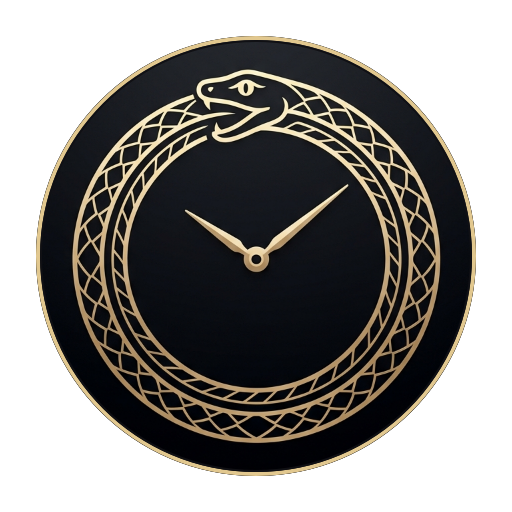
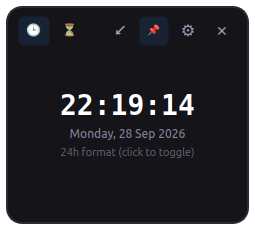
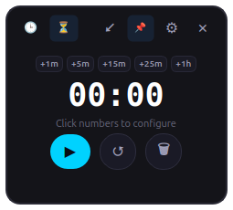
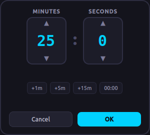
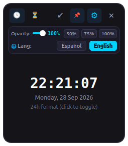

# 🕒 Clock & Timer (Reloj & Temporizador Flotante)

<p align="center">
  
</p>

<p align="center">
  <strong>A modern, minimalist, always-on-top desktop clock and countdown timer widget.</strong><br>
  <em>Diseñado para Linux (Ubuntu, Fedora, Arch) y 100% compatible con Windows.</em>
</p>

<p align="center">
  <a href="https://github.com/JohnmaDev/Clock-Timer/releases"></a>
  <a href="LICENSE"></a>
  
  
  
  <a href="https://github.com/flathub/flathub/pull/10413"></a>
</p>

---

## 📸 Screenshots / Capturas

<p align="center">
  
  
</p>
<p align="center">
  <em>Clock View (24h/12h toggle) &nbsp;&bull;&nbsp; Minimalist Timer View (Icon actions & quick presets)</em>
</p>

<p align="center">
  
</p>
<p align="center">
  <em>Mini-HUD Focus Mode (Ultra-compact 230x75 px floating strip)</em>
</p>

<p align="center">
  
  
</p>
<p align="center">
  <em>Precision Stepper Setup Dialog &nbsp;&bull;&nbsp; Unified Opacity & Language Settings</em>
</p>

---

## ✨ Features / Características

- 📌 **Always on Top (Siempre al Frente)**: Permanece visible por encima de navegadores, editores de código, IDEs y juegos. Se activa/desactiva al instante con el botón de chincheta (`📌`).
- 🪟 **Frameless & Ultra-Compact (Sin Marcos y Redimensionable)**: Interfaz oscura moderna sin barras toscas del sistema. Redimensionable desde sus 4 bordes o esquina inferior (mínimo ultra-compacto: 235 &times; 210 px).
- ⚡ **Ultra-Lightweight (~87 MB RAM, <0.2% CPU)**: Rendimiento nativo Qt6 sin el sobrecosto de Chromium ni frameworks web pesados. 8-10 veces más ligero que herramientas en Electron.
- 🕒 **Minimalist Clock Mode (Modo Reloj)**: Visualización limpia de hora con segundos y fecha completa localizada. Clic en los dígitos para alternar al instante entre **formato 24h** y **formato 12h AM/PM**.
- ⏳ **Minimalist Timer Mode (Modo Temporizador)**: 
  - **Controles por iconos limpios**: Iniciar/Pausar (`▶`/`⏸`), Reiniciar (`↺`) y Borrar/Restablecer (`🗑`) para evitar recortes de texto en tamaños pequeños.
  - **Presets rápidos**: Botones inmediatos de `+1m`, `+5m`, `+15m`, `+25m (Pomodoro)` y `+1h`.
  - **Selector dial de precisión**: Clic en los números para abrir el configurador visual con botones paso a paso (`▲`/`▼`) y chips rápidos (`+1m`, `+5m`, `+15m`, `00:00`).
- 🔍 **Mini-HUD Focus Mode**:
  - Modo ultra-reducido de 230 &times; 75 px que ocupa el mínimo espacio en pantalla.
  - Preserva la posición exacta donde colocaste la ventana sin saltar al centro al restaurarla.
  - Atajo rápido: Tecla `M` o `F`, o botón `↙` en la cabecera.
- 🔔 **Smart Non-Intrusive Desktop Notifications**:
  - En Linux: Alarma de escritorio con nombre de la app (`Clock & Timer`), icono oficial y **auto-cierre a los 5 segundos** (no se queda congelada en pantalla).
  - En Windows: Notificaciones nativas integradas con el Centro de Actividades (Action Center).
  - Alerta combinada sonora (`beep` del sistema) y parpadeo visual llamativo.
- 🗔 **System Tray Integration (Bandeja del Sistema)**:
  - Icono residente en la bandeja (`^`) para mostrar u ocultar la ventana, alternar rápidamente entre Reloj y Temporizador o cerrar la app.
- ◐ **Interactive Opacity Control (Transparencia Interactiva)**:
  - Barra deslizante de opacidad del 30% al 100% con saltos rápidos (`50%`, `75%`, `100%`).
  - **Rueda del ratón (Mouse Wheel)**: Gira la rueda del mouse en cualquier parte de la ventana para ajustar la transparencia al vuelo.
- 🌐 **Bilingual Support (Español / English)**:
  - Selector instantáneo en el panel de ajustes con persistencia de preferencias (`QSettings`).

---

## 🕹️ Keyboard & Mouse Controls / Atajos

| Action / Acción | Control / Gesto |
| :--- | :--- |
| **Move window** / Mover ventana | Clic y arrastre desde la cabecera, pestañas o dígitos del reloj |
| **Resize** / Redimensionar | Arrastrar cualquiera de los 4 bordes o la esquina inferior derecha |
| **Adjust opacity on the fly** / Opacidad al vuelo | **Rueda del mouse** en cualquier parte de la ventana |
| **Toggle Mini-HUD Mode** / Modo Mini-HUD | Tecla `M`, tecla `F` o botón `↙` / `⤢` |
| **Start / Pause Timer** / Iniciar o pausar | Tecla `Space` o botón `▶`/`⏸` |
| **Reset / Clear** / Reiniciar o borrar | Botones `↺` y `🗑` |
| **Switch Clock / Timer tab** / Alternar pestaña | Tecla `Tab` o botones `🕒` / `⏳` |
| **Toggle Settings Panel** / Panel de ajustes | Botón `⚙` |
| **Toggle Always on Top** / Fijar al frente | Botón `📌` |
| **System Tray** / Bandeja del sistema | Clic izquierdo en el icono de la bandeja para mostrar/ocultar |
| **Close app** / Cerrar | Tecla `Escape` o botón `✕` |

---

## 🚀 Installation & Running / Instalación y Uso

### 🐧 Linux (Ubuntu / Debian / Fedora / Arch)

#### Option 1: Quick Launcher (Recomendado)
```bash
git clone https://github.com/JohnmaDev/Clock-Timer.git
cd Clock-Timer
chmod +x run.sh
./run.sh
```
*(Crea automáticamente el entorno virtual e instala dependencias si es necesario).*

#### Option 2: Run with Python venv
```bash
python3 -m venv .venv
source .venv/bin/activate
pip install -r requirements.txt
python3 main.py
```

#### Option 3: Add to Desktop Menu / Dock
```bash
cp io.github.JohnmaDev.Clock-Timer.desktop ~/.local/share/applications/
```

---

### 📦 Flatpak & Flathub
Esta aplicación sigue las directrices oficiales de empaquetado de Freedesktop y Flathub:
- **App ID**: `io.github.JohnmaDev.Clock-Timer`
- **Metadata**: [io.github.JohnmaDev.Clock-Timer.metainfo.xml](io.github.JohnmaDev.Clock-Timer.metainfo.xml)
- **Manifest**: [io.github.JohnmaDev.Clock-Timer.yaml](io.github.JohnmaDev.Clock-Timer.yaml)

Para seguir el progreso de aprobación oficial, visita [Flathub PR #10413](https://github.com/flathub/flathub/pull/10413).

---

### 🪟 Windows

#### 📦 Descargar Ejecutable Portátil (`Clock & Timer.exe`)
¡No necesitas tener Python instalado! Descarga el ejecutable precompilado **`Clock & Timer.exe`** directamente desde la página de [GitHub Releases](https://github.com/JohnmaDev/Clock-Timer/releases).

O compílalo tú mismo con PyInstaller:
```cmd
pip install pyinstaller
pyinstaller --onefile --windowed --name "Clock & Timer" --icon "icon.ico" --add-data "app;app" --add-data "icon.png;." main.py
```

---

## 🤖 Continuous Integration / GitHub Actions

El repositorio cuenta con integración continua automatizada en [`.github/workflows/release.yml`](.github/workflows/release.yml):
1. Valida los metadatos AppStream y `.desktop` con `appstreamcli` y `desktop-file-validate`.
2. Compila el binario independiente para Linux (`Clock-Timer-Linux-x86_64`), paquetes nativos `.deb` y `.rpm`, y `AppImage`.
3. Compila el ejecutable nativo para Windows (`Clock & Timer.exe`).
4. Genera automáticamente las notas de lanzamiento categorizadas ([`.github/release.yml`](.github/release.yml)) y publica la Release en GitHub con todos los archivos descargables.
5. Registra el historial de versiones en el [`CHANGELOG.md`](CHANGELOG.md) siguiendo el estándar *Keep a Changelog*.

---

## 📂 Project Structure / Estructura del Proyecto

```text
Clock-Timer/
├── .github/
│   ├── release.yml                     # GitHub automated release notes categories
│   └── workflows/
│       └── release.yml                 # Automated Linux & Windows CI/CD release workflow
├── app/
│   ├── __init__.py                     # Package initialization
│   ├── clock_widget.py                 # Responsive clock display & 12h/24h toggle
│   ├── draggable_widgets.py            # GNOME-style dual click/drag gesture labels
│   ├── i18n.py                         # Internationalization engine (EN / ES) & settings
│   ├── styles.py                       # Modern dark-mode QSS stylesheets & minimalist icons
│   ├── timer_widget.py                 # Countdown timer, presets, alarms & stepper dialog
│   └── window.py                       # Frameless floating window, resizing, HUD & system tray
├── assets/
│   ├── branding/                       # Design concepts & exploration artwork
│   ├── icons/                          # Application icon (512x512 circular PNG)
│   └── screenshots/                    # Updated UI preview screenshots
├── CHANGELOG.md                        # Standardized release changelog
├── io.github.JohnmaDev.Clock-Timer.desktop     # FreeDesktop desktop entry
├── io.github.JohnmaDev.Clock-Timer.metainfo.xml# AppStream 1.0 metadata
├── io.github.JohnmaDev.Clock-Timer.png         # Standard App ID icon
├── io.github.JohnmaDev.Clock-Timer.yaml        # Flatpak build manifest
├── LICENSE                             # MIT License
├── main.py                             # Application entry point
├── README.md                           # Documentation & showcase
├── requirements.txt                    # Python dependencies (PyQt6)
└── run.sh                              # Linux auto-launcher script
```

---

## 📄 License

Distributed under the **MIT License**. See [LICENSE](LICENSE) for more details.

Developed with ❤️ by [JohnmaDev](https://github.com/JohnmaDev).
